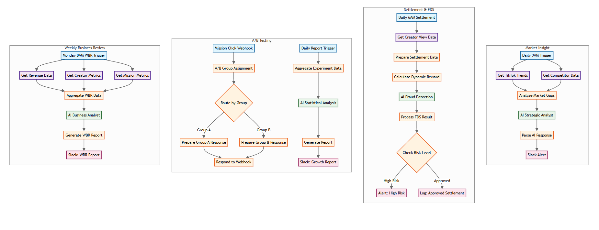
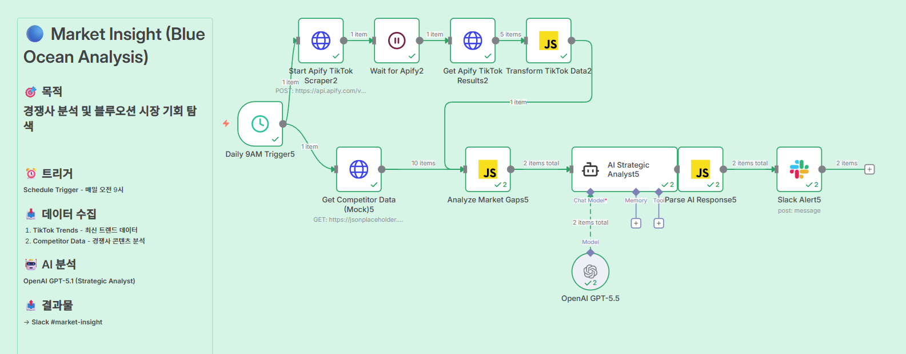
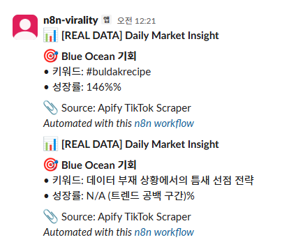
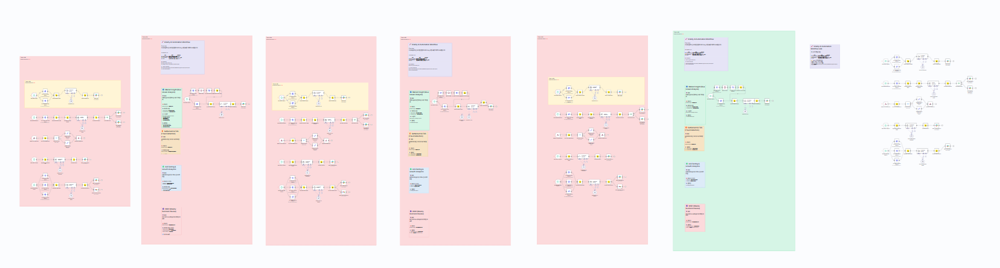

> **🚧 Development Status: Paused (Blocked by External Dependency)**
>
> **Project Progress**
> ```text
> Workflow Architecture : [██████████] 100% (Completed)
> System Implementation : [████████░░] 80%  (In Progress)
> TikTok API Approval   : [░░░░░░░░░░] 0%   (Pending)
> ```
> **Current Blocker**: The automated workflow design is fully complete. However, the final integration is currently **paused** pending approval for the **TikTok Advertising Account**, which is required to access the necessary APIs for ad execution and tracking.

This repository documents the **Virality v24** n8n workflow, designed to automate the lifecycle of TikTok viral marketing, from trend analysis to creator settlement.

## Workflow Structure



The workflow is divided into four key sections:

1.  **Market Insight (Daily 09:00)**
    *   Analyzes TikTok trends and competitor data.
    *   Identifies "Blue Ocean" opportunities using AI.
    *   Generates strategic insights and mission recommendations.
    *   Alerts via Slack (#market-insight).

2.  **Settlement & FDS (Daily 06:00)**
    *   Aggregates creator performance data (Views, Likes, Comments).
    *   Calculates dynamic rewards based on grade, category, and seasonality.
    *   **AI Fraud Detection System (FDS)**: Analyzes traffic patterns to detect abuse.
    *   Processes settlements (Approved/Hold/Blocked) and alerts via Slack (#fraud-alerts, #settlements).

3.  **A/B Testing (Event-Driven)**
    *   Triggered by mission clicks.
    *   Assigns users to Control (Group A) or Test (Group B) groups.
    *   Evaluates copy/incentive effectiveness (e.g., Emotional vs. Reward-focused).
    *   **AI Statistical Analysis**: Validates hypotheses and determines winners.

4.  **Weekly Business Review (Monday 08:00)**
    *   Aggregates weekly revenue, creator retention, and mission metrics.
    *   **AI Business Analyst**: Generates an executive summary and health score.
    *   Delivers a comprehensive WBR report to Slack (#wbr-reports).

## Execution Results

### Successful Workflow Execution


### Slack Notifications & Reports


### Trial Run Data

